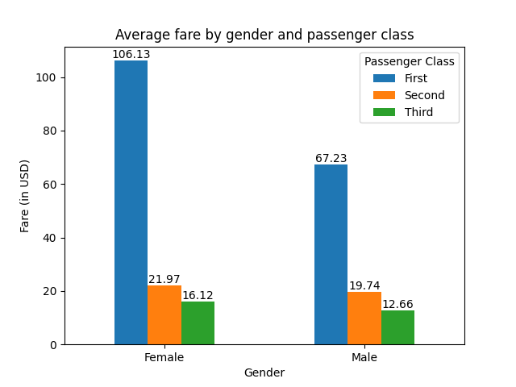
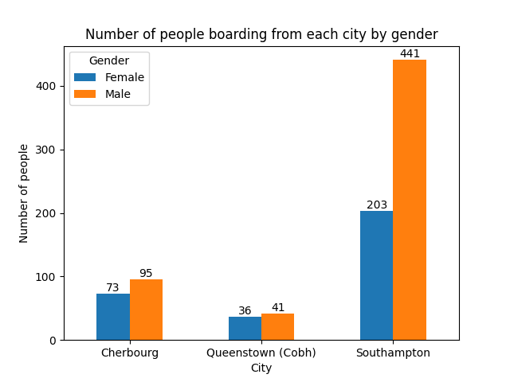
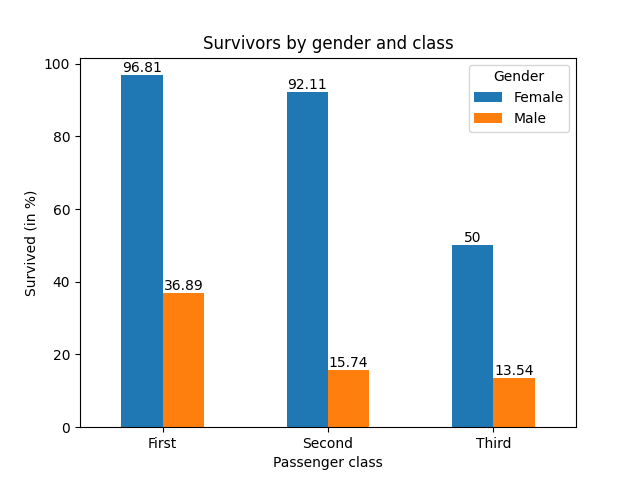

# Titanic Data Analysis

This repository contains files used for analysing passenger data of the RMS Titanic, which unfortunately sank in the North Atlantic Ocean during its maiden voyage on 15 April 1912.

Click [here](https://en.wikipedia.org/wiki/Titanic) to visit the Wikipedia page on the Titanic.

---

## Infomation gathered from the data

### 1) Average price of a ticket categorised by the gender and age of the passengers.

#### Women between the ages of **20** and **60** (rounded off to the nearest 10) paid more for their tickets on average than men of the same age.

---

### 2) Average price of ticket categorised by the gender of the passengers and the classes of seats on the ship.

- In **First** Class, the average price of a ticket for women was **$38.9** more than men.

- In **Second** and **Third** Class, the average price of a ticket was around the same for both men and women.

---

### 3) Number of people boarding from each city categorised by the gender of the passengers.

- In **Cherbourg** and **Queenstown (Cobh)**, the number of male and female passengers were almost the same.

- In **Southampton**, there were **238** more male passengers than female passengers.

---

### 4) Number of survivors categorised by the gender of the passengers and classes of seats on the ship.

- In **First** Class, **96.81%** of women and **36.89%** of men survived the accident.

- In **Second** Class, **92.11%** of women and **15.74%** of men survived the accident.

- In **Third** Class, **50%** of women and **13.54%** of men survived the accident.